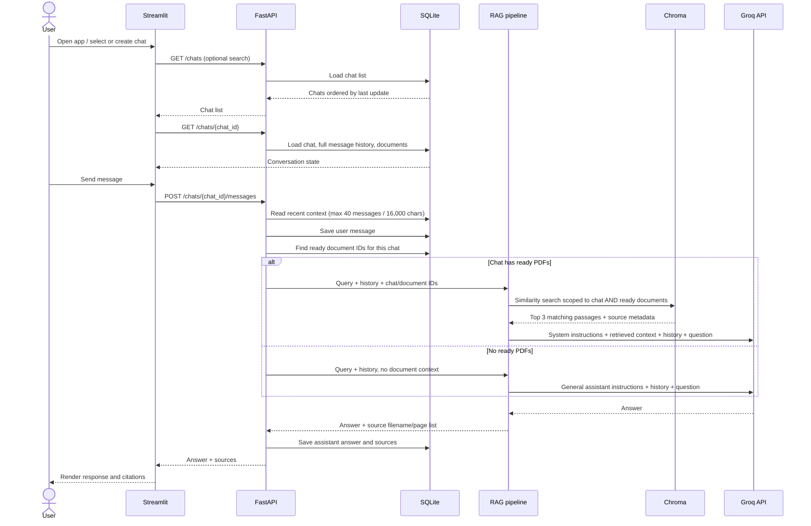

# Conversation Flow

This page renders the conversation lifecycle in GitHub's Mermaid viewer.

```mermaid
sequenceDiagram
    actor User
    participant UI as Streamlit
    participant API as FastAPI
    participant DB as SQLite
    participant RAG as RAG pipeline
    participant VDB as Chroma
    participant LLM as Groq API

    User->>UI: Open app / select or create chat
    UI->>API: GET /chats (optional search)
    API->>DB: Load chat list
    DB-->>API: Chats ordered by last update
    API-->>UI: Chat list
    UI->>API: GET /chats/{chat_id}
    API->>DB: Load chat, full message history, documents
    DB-->>UI: Conversation state

    User->>UI: Send message
    UI->>API: POST /chats/{chat_id}/messages
    API->>DB: Read recent context (max 40 messages / 16,000 chars)
    API->>DB: Save user message
    API->>DB: Find ready document IDs for this chat
    alt Chat has ready PDFs
        API->>RAG: Query + history + chat/document IDs
        RAG->>VDB: Similarity search scoped to chat AND ready documents
        VDB-->>RAG: Top 3 matching passages + source metadata
        RAG->>LLM: System instructions + retrieved context + history + question
    else No ready PDFs
        API->>RAG: Query + history, no document context
        RAG->>LLM: General assistant instructions + history + question
    end
    LLM-->>RAG: Answer
    RAG-->>API: Answer + source filename/page list
    API->>DB: Save assistant answer and sources
    API-->>UI: Answer + sources
    UI-->>User: Render response and citations
```
